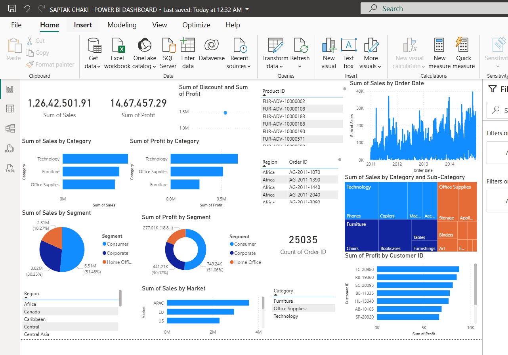
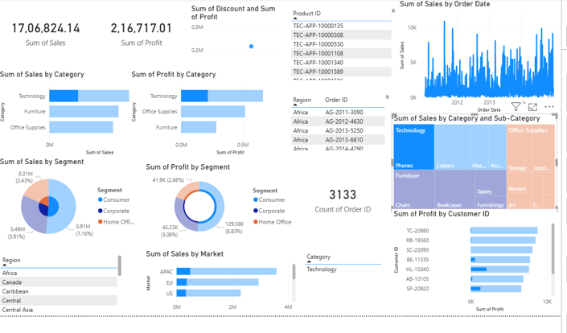
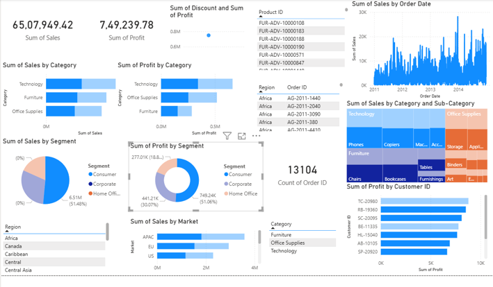
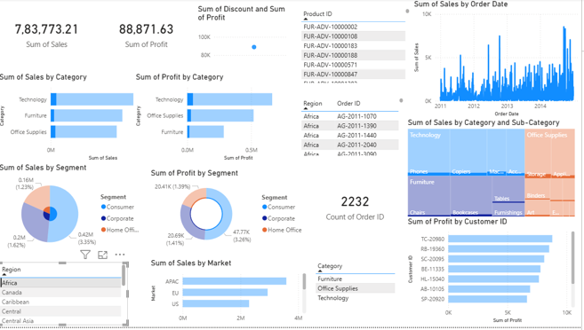
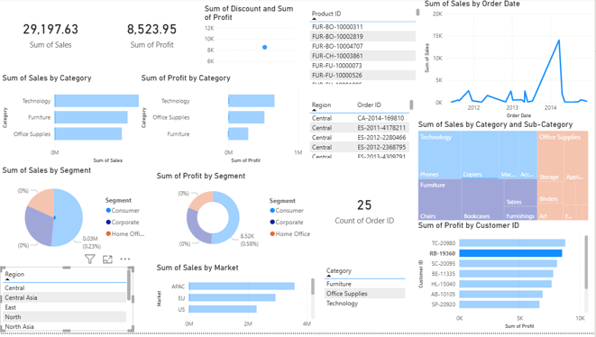

# Global-Superstore-Dataset-POWER-BI-DASHBOARD

# 📊 Superstore Sales Dashboard

A comprehensive **Power BI Dashboard** analyzing the **Superstore Sales Dataset** to provide insights into sales performance, customer behavior, and product trends. This project leverages **data analytics** to help businesses make data-driven decisions.

---

## 📝 Project Overview

The dashboard provides interactive visualizations of the **Superstore Sales Dataset**, including sales, profit, quantity sold, and regional performance.  
It helps identify:

- Top-performing products and categories  
- Regional sales distribution  
- Profit trends over time  
- Customer purchasing patterns  

**Dataset Source:** [Kaggle – Global Superstore Dataset](https://www.kaggle.com/datasets/apoorvaappz/global-super-store-dataset?resource=download)

---

## 🔍 Features

- **Sales & Profit Analysis:** Interactive charts showing trends and totals.  
- **Category & Sub-category Insights:** Drill-down views to explore top products.  
- **Regional Performance:** Map visualizations for sales and profit by region.  
- **Time-based Analysis:** Trends over months, quarters, and years.  
- **Customer Insights:** Identify high-value customers and purchase patterns.  

---

## 🛠️ System Approach

1. **Data Collection:**  
   - Imported historical Superstore sales data.  
2. **Data Cleaning & Preprocessing:**  
   - Removed duplicates, handled missing values, and formatted dates.  
3. **Dashboard Creation:**  
   - Used **Power BI** to create interactive reports and visualizations.  
   - Incorporated slicers, filters, and drill-down features for dynamic analysis.  

---

## 💡 Future Scope

- Integrate **predictive analytics** to forecast future sales.  
- Include **real-time dashboards** for live sales monitoring.  
- Enhance with **machine learning models** for product recommendations and demand forecasting.  

---

## 📈 Screenshots

  
  
  
  
  

---

## 📚 References

- [Kaggle – Global Superstore Dataset](https://www.kaggle.com/datasets/apoorvaappz/global-super-store-dataset?resource=download)  

---

## ✅ Notes

- No sensitive data is included.  
- The dashboard is built entirely with **Power BI Desktop**.  
